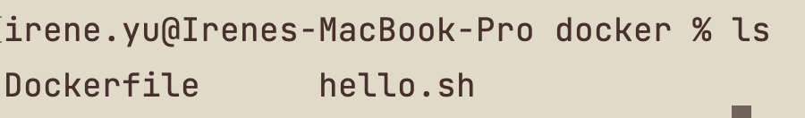
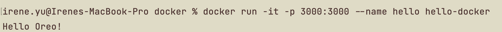

# Docker

创建一个image, 运行它, 它可以在屏幕上输出“Hello Oreo!”。

1. 安装 Docker Desktop 并且运行它。
2. 所需的base image 可以去[https://hub.docker.com/search?q=](https://hub.docker.com/search?q=) 上找
3. 在工作目录下, 创建一个bash script: hello.sh, 让它可以在屏幕上输出”Hello Oreo!”
    
    ```jsx
    #!/bin/bash
    echo "Hello Oreo!"
    ```
    
4. 在工作目录下，创建一个Dockerfile:
    
    ```jsx
    FROM bash:5.2 // 选择bash 5.2作为base image
    WORKDIR /workspace // image里创建一个工作目录
    COPY hello.sh /workspace/hello.sh // 把本地的hello.sh 拷贝进工作目录
    RUN chmod -v +x /workspace/hello.sh // 设置访问权限
    ENTRYPOINT ["bash", "/workspace/hello.sh"] // 设置entry point：运行image的时候，运行hello.sh 
    ```
    
    此时，工作目录下有两个文件 hello.sh和Dockerfile:
    
    
    
5. Terminal里的工作目录下输入命令行Build image:
    
    `docker build -t hello-docker .`
    
    “hello-docker” 是image的名字。
    
    Build 完成后， 用`docker images` 查看所有的images，可以看到 hello-docker 在列表里。
    
    输入以下命令行在一个名叫”hello” 的容器里运行 image “hello-docker”:
    
    `docker run -it -p 3000:3000 --name hello hello-docker`
    
    运行成功后看到屏幕上输出：
    
    
    
    查看本地所有的容器：`docker ps -a`
    
    删除容器：`docker rm [容器名字或ID]`
    
    删除镜像：`docker rmi [镜像名]`
    
7. 如果Dockerfile内容变了或者hello.sh内容变了，需要先删除容器，再删除镜像，重新build 一个镜像出来。
8. 了解更多： [https://www.jianshu.com/p/6cadb5b722ac](https://www.jianshu.com/p/6cadb5b722ac)
9. 有用的命令：
   
* `docker ps` //查看系统中运行的docker容器
* `docker kill [container]` //删除docker容器
* `docker stop [container]` //停止正在运行的docker容器
* `docker attach/exec [container]` //进入容器
* `docker run` //运行镜像，生成容器
* `docker images` //查看系统中存在的docker镜像
* `docker rmi [image]` //删除镜像
* `docker build` //生成镜像
* `docker pull` //拉取镜像
* `docker push` //上传镜像 
* `docker search` //搜索镜像
